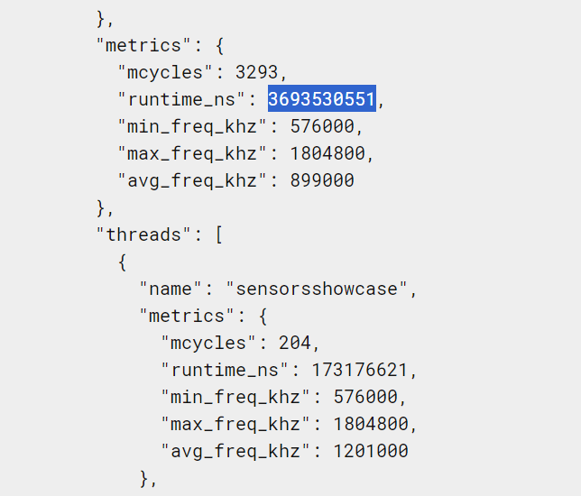

# Qustion 1: Tracing & Profiling using Perfetto
<!-- center the image -->

    

<!-- part1 -->

## Part 1: What has happened at the operating system level since reading data to a sensor to get data?
As we can see in the following picture, these are the steps of the process that happened at the operating system level since reading data to a sensor to get data:
* The sensors start to read data at a default frequency. which is period=200000000.
* When we set a new data frequency, the sensors start to read data at the new frequency.

What happens at the operating system level can be summarized as follows:
* Data requests is sent to the sensor.
* The sensor reads the data.
* The sensor sends the data to the sensor manager.
* The sensor manager sends the data to the sensor service.
* The sensor service sends the data to the sensor HAL.
* The sensor HAL sends the data to the sensor driver.
* The sensor driver reads the data from the sensor.
* The sensor driver sends the data to the sensor HAL.
* The sensor HAL sends the data to the sensor service.
* The sensor service sends the data to the sensor manager.
* The sensor manager sends the data to the application.

    

In fact, by using (send_sync_sensor_request) `send sync request time` and (send_sync_sensor_request) `recieve the response with 0` property, we can see that time it takes to send a request and recieve the response is 3 ms.

<!-- picture with caption "Note: this picture is taken from another program and it is not related to the sensors showcase program" -->

    
    
Note: this picture is taken from another program and it is not related to the sensors showcase program

## Part 2: Compare the time between reading two consecutive data from the sensor in Perfetto with the sampling period that configures in the code.
The time between reading two consecutive data from the sensor in Perfetto is 102 ms, which is close to the sampling period that configures in the code, which is 100 ms.
<!-- picture with caption "Perfetto result" -->

    
    
Perfetto result

## Part 3: What is the time it takes to send a request and receive the response?
Yes, there can be a conflict between busy waiting a thread and updating sensors, particularly in concurrent processing scenarios like using a graphics library. Busy waiting consumes CPU cycles continuously, which can starve other threads, including those responsible for sensor updates, leading to inefficiencies such as delayed sensor data and impaired graphics rendering. This contention can degrade overall system performance, cause timing and synchronization issues, and increase power consumption. To avoid these conflicts, it is better to use synchronization mechanisms like condition variables, mutexes, or event-driven programming, which allow the CPU to allocate resources more efficiently and ensure smooth operation of both graphics processing and sensor updates.

As we can see in the following picture, there are several busy waitings.
<!-- picture with caption "Qt profiler screenshot" -->

    
    
Qt profiler screenshot

    
    
Qt profiler screenshot

    
    
Qt profiler screenshot

## Part 4: Compare the time required for data processing sensors to other CPU processing time.
As we can see in the following pictures, the time required for data processing sensors is `401302800` ns and the time taken for other CPU processing is `3693530551`. By comparing these values that are getting from the Perfetto, we can see about 10% of the CPU processing time is used for data processing sensors.
<!-- two pictures next to each other in a rwo with caption "Perfetto result" -->

    
    
    
Perfetto result

# Question 2: How much is the best periodic period for reading accelerometer sensor (and gyroscope)?
The best periodic period for reading accelerometer and gyroscope sensors typically ranges from 10 to 100 milliseconds (10-100 Hz), depending on the application:

- **High-Frequency Applications (10-20 ms or 50-100 Hz)**:
  - **Motion Tracking**: Virtual reality (VR), augmented reality (AR), and gaming require precise motion capture.
  - **Inertial Navigation Systems**: Robotics, drones, and automotive systems need accurate trajectory and orientation data.

- **Medium-Frequency Applications (20-50 ms or 20-50 Hz)**:
  - **Activity Recognition**: Wearable fitness trackers can distinguish physical activities effectively.
  - **Stabilization and Control**: Camera and vehicle stabilization systems benefit from responsive adjustments.

- **Low-Frequency Applications (50-100 ms or 10-20 Hz)**:
  - **Environmental Monitoring**: Long-term changes in orientation or tilt detection require less frequent updates.
  - **Battery-Powered Devices**: Lower sampling rates help conserve battery life.

### Conclusion
The optimal sampling period balances data accuracy and responsiveness with power consumption, tailored to the specific requirements of the application.

In our program, we set the sampling period to 100 ms (10 Hz) for both the accelerometer and gyroscope sensors. This frequency provides a good balance between real-time responsiveness and energy efficiency for general-purpose applications. However, for more demanding tasks like motion tracking or precise control systems, a higher sampling rate may be necessary to capture rapid movements accurately.

# Question 3:
## Hardware-Based Sensors:
### Definition:
Hardware-based sensors are physical devices that directly measure various quantities (such as temperature, pressure, light, or motion) using specific sensing techniques.
### Functionality:
Hardware sensors convert physical phenomena (e.g., changes in resistance, capacitance, or light intensity) into electrical signals.
They typically consist of transducers (e.g., thermistors, accelerometers, or photodiodes) that perform the conversion.
The output signal from a hardware sensor is often analog (continuous voltage or current).
* Examples include temperature sensors (thermocouples, RTDs), pressure sensors (piezoelectric sensors), and **motion sensors (accelerometers).**
### How They Work:
Hardware sensors interact directly with the physical environment.
For instance, a temperature sensor measures the resistance change in a thermistor due to temperature variations.
The analog signal is then conditioned (amplified, filtered) and converted to digital form (using an analog-to-digital converter, ADC).
The digital data can be processed by a microcontroller or transmitted to other devices.
### Key Points:
Hardware sensors are essential for accurate and direct measurements.
They require dedicated hardware components and are often specific to a particular application.
## Software-Based Sensors:
### Definition:
Soft sensors (or software sensors) predict the behavior of physical sensors without additional hardware.
### Functionality:
Soft sensors use existing data (from other sensors or sources) and apply machine learning algorithms or mathematical models.
They estimate process variables (e.g., temperature) indirectly.
* Examples include predicting air quality based on historical data or estimating glucose levels in a diabetic patient.
### How They Work:
Soft sensors leverage data fusion and machine learning techniques.
They analyze historical sensor data, environmental factors, and other relevant information.
The output is an inferred measurement, not directly obtained from a physical sensor.
Soft sensors can compensate for sensor errors or provide additional insights.
### Key Points:
Soft sensors are cost-effective (no additional hardware required).
They enhance system reliability and provide valuable information.
Examples include predictive maintenance, health monitoring, and quality control. 
## Difference:
### Hardware Sensors:
* Directly measure physical quantities.  
* Require dedicated hardware components.  
* Provide accurate, real-time data. 
## Software Sensors:
* Estimate variables using existing data. 
* Leverage machine learning or mathematical models. 
* Cost-effective but rely on data quality. 
### The accelerometer and gyroscope sensors are always hardware-based.
In summary, hardware sensors directly measure physical quantities, whilesoftware sensors estimate variables using existing data. Both play crucialroles in embedded systems, offering a balance between accuracy andcost-effectiveness.

# Question 4:
## Wake-Up Sensors:
### Definition:
Wake-up sensors are designed to operate in a low-power state most of the time, waking up only when specific events or conditions occur.
They remain in an energy-efficient sleep mode until triggered by an external signal.
### Pros:
* Energy Efficiency:
Wake-up sensors consume minimal power during sleep, significantly extending battery life.
Ideal for battery-powered devices (e.g., wireless sensor nodes, IoT devices).
* Reduced Idle Time:
By avoiding continuous operation, wake-up sensors reduce idle time and unnecessary communication.
This leads to better overall system performance.
* Collision Avoidance:
Wake-up sensors can avoid collisions by activating only when necessary.
In wireless networks, this prevents interference and improves reliability.
### Examples:
Wake-up receivers in wireless sensor networks1.
Wake-up radios in IEEE 802.11-enabled devices2.
### Cons:
* Latency:
Wake-up sensors introduce latency because they need time to wake up and become operational.
Real-time applications may be affected.
* Complexity:
Implementing wake-up mechanisms requires additional circuitry and synchronization.
Design complexity increases.
* Limited Wake-Up Codes:
Wake-up sensors rely on specific wake-up codes or patterns.
If the code is not detected correctly, the sensor may miss relevant events.
* Energy Cost of Wake-Up Detection:
On receiving a wake-up signal, the sensor activates more complex stages to verify the wake-up code, consuming additional energy1.
## Non-Wake-Up Sensors:
### Definition:
Non-wake-up sensors operate continuously, sensing and transmitting data without entering a low-power sleep mode.
They are always active, providing real-time measurements.
### Pros:
* Low Latency:
Non-wake-up sensors have minimal latency since they are always ready to respond.
Suitable for time-critical applications.
* Simplicity:
No need for wake-up mechanisms or synchronization.
Simpler hardware design.
* Continuous Monitoring:
Non-wake-up sensors provide continuous data, essential for real-time monitoring.
### Examples:
Traditional accelerometers, temperature sensors, and light sensors.
### Cons:
* Higher Power Consumption:
Non-wake-up sensors continuously draw power, leading to shorter battery life.
Not ideal for energy-constrained devices.
Idle Energy Waste:
Even during idle periods, non-wake-up sensors consume energy.
May lead to unnecessary power drain.
* Risk of Collisions:
Continuous operation increases the risk of collisions in wireless networks.
Interference may occur.
### Examples:
Always-on smartphone sensors (e.g., accelerometers, gyroscopes).  
In summary, wake-up sensors prioritize energy efficiency and collision avoidance, while non-wake-up sensors offer low latency and continuous monitoring.